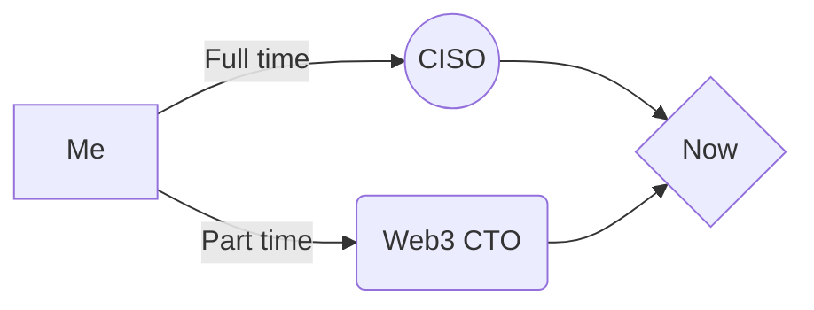
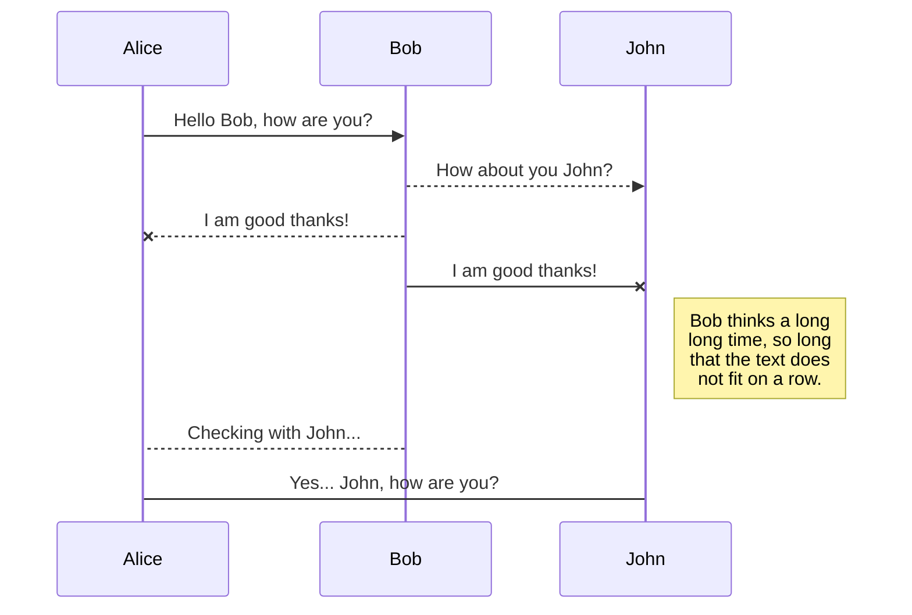

# Hi there 👋
- 👋 Hi, I’m @ziasistani
- 👀 I’m interested in C# and Java Python Javascript Typescript Distributed Decentralized DLT Blockchain Hashgraph P2P Security ...  
- 💞️ I’m looking to collaborate on Web3 Projects
- 💬 You may call me after connecting on [LinkedIn](https://www.linkedin.com/in/ziasistani/)
- 📫 You can reach me via : |ziasistani| at |gmail| dot |com|
- 🔭 I’m working for a startup
- 😄 Pronouns: He
- ⚡ A fact: Simplicity wins 

$$
\Gamma(z) = \int_0^\infty t^{z-1}e^{-t}dt\,.
$$

